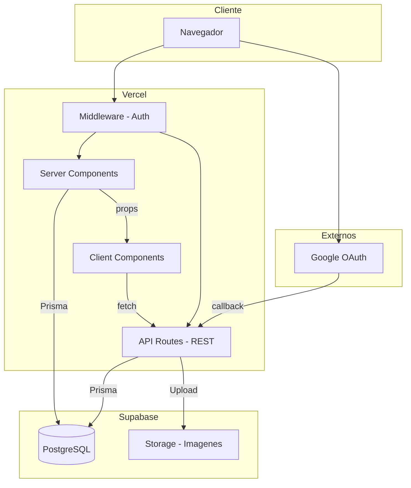
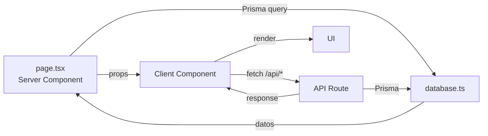
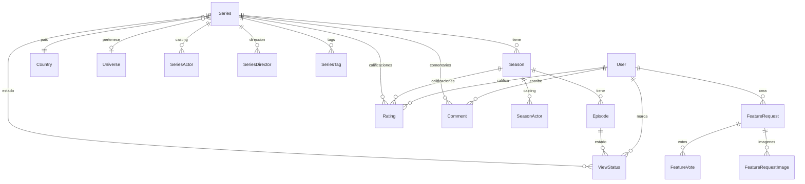

# MundoBL

Catalogo personal de Flor de series asiaticas BL/GL y otros generos. Gestion, calificacion y seguimiento de series, peliculas, cortos y especiales.

**URL:** [mundobl.win](https://mundobl.win)

---

## Stack

| Tecnologia | Version | Uso |
|---|---|---|
| Next.js | 16 | Framework full-stack (App Router) |
| React | 19 | UI |
| TypeScript | 5.9 | Tipado estricto |
| Ant Design | 6 | Componentes UI |
| Prisma | 7.4 | ORM |
| PostgreSQL | - | Base de datos |

## Infraestructura

| Servicio | Detalle |
|---|---|
| Hosting | Vercel (deploy automatico desde GitHub) |
| Base de datos | Supabase PostgreSQL |
| Almacenamiento | Supabase Storage (imagenes) |
| Dominio | mundobl.win (DNS en Cloudflare) |
| Auth | NextAuth.js (Google OAuth) |

---

## Arquitectura



### Flujo de datos



---

## Desarrollo

```bash
npm install
npm run dev          # http://localhost:3000
npm run build        # Build produccion
npm run lint:fix     # Lint + fix
npm run format       # Prettier
npm run type-check   # Verificar tipos
```

### Variables de entorno

Copiar `.env.example` y completar:

```env
# Base de datos
DATABASE_URL=          # Supabase transaction pooler (puerto 6543)
DIRECT_URL=            # Supabase session pooler (puerto 5432)

# Auth
AUTH_SECRET=            # Secret para NextAuth
AUTH_GOOGLE_ID=         # Google OAuth client ID
AUTH_GOOGLE_SECRET=     # Google OAuth client secret

# Storage
NEXT_PUBLIC_SUPABASE_URL=      # URL del proyecto Supabase
SUPABASE_SERVICE_ROLE_KEY=     # Service role key de Supabase

# Info del proyecto (opcional, para /admin/info)
PROJECT_GITHUB_URL=
PROJECT_VERCEL_URL=
PROJECT_SUPABASE_URL=
```

### Migraciones (Prisma)

```bash
npx prisma migrate dev --name descripcion    # Crear migracion
npx prisma generate                          # Regenerar cliente
npx prisma studio                            # UI para explorar datos
npx prisma migrate deploy                    # Aplicar en produccion
```

---

## Estructura del proyecto

```
src/
├── app/                          # Next.js App Router
│   ├── api/                      # REST API
│   │   ├── series/               # CRUD series + ratings, comments, favorites
│   │   ├── seasons/              # CRUD temporadas
│   │   ├── episodes/             # CRUD episodios + view-status
│   │   ├── actors/               # CRUD actores + merge
│   │   ├── directors/            # CRUD directores + merge
│   │   ├── tags/                 # CRUD tags + merge
│   │   ├── universes/            # CRUD universos
│   │   ├── feature-requests/     # Feedback + votos
│   │   ├── upload/               # Subida de imagenes (Supabase Storage)
│   │   └── admin/info/           # Info del proyecto (env vars)
│   ├── catalogo/                 # Catalogo publico con filtros
│   ├── admin/                    # Panel admin (CRUD completo)
│   ├── watching/                 # Dashboard "Viendo ahora"
│   ├── feedback/                 # Feedback + Changelog
│   ├── actores/                  # Perfiles de actores
│   └── directores/               # Perfiles de directores
├── components/
│   ├── layout/                   # AppLayout, Header, Sidebar, BottomNav
│   ├── common/                   # PageTitle, SearchBar, CommentsList
│   ├── series/                   # SeriesHeader, SeasonsList, EpisodesList, ViewStatusToggle
│   ├── admin/                    # SeriesForm, SeasonForm
│   └── watching/                 # CurrentlyWatchingDashboard
├── lib/
│   ├── database.ts               # Helpers Prisma (queries tipadas)
│   ├── supabase.ts               # Cliente Supabase Storage
│   ├── auth-helpers.ts           # requireAuth, requireRole
│   └── theme.config.ts           # Tema Ant Design
├── hooks/                        # useMediaQuery, useMessage
├── types/                        # content.ts, series.types.ts, person.types.ts
├── constants/                    # navigation.ts, series.ts
└── styles/                       # variables.css, globals.css, dark-mode-fixes.css
```

---

## Modelo de datos



### Modelos principales

| Modelo | Descripcion |
|---|---|
| `Series` | Serie, pelicula, corto o especial |
| `Season` | Temporada de una serie |
| `Episode` | Episodio de una temporada |
| `Actor` / `Director` | Personas del reparto y direccion |
| `Universe` | Agrupacion de series relacionadas |
| `Tag` | Etiquetas (tropes, genres, moods) |
| `ViewStatus` | Estado de visualizacion por usuario |
| `Rating` | Calificaciones por categoria |
| `Comment` | Comentarios en serie/temporada/episodio |
| `FeatureRequest` | Solicitudes de feedback con votos e imagenes |

---

## Glosario

### Tipos de contenido

| Tipo | Descripcion |
|---|---|
| **Serie** | Contenido con temporadas y episodios. El tipo mas comun. |
| **Pelicula** | Contenido sin temporadas ni episodios. Tiene duracion en minutos. |
| **Corto** | Cortometraje. Sin temporadas, con duracion. |
| **Especial** | Contenido especial (detras de camaras, extras, fan meetings). Soporta temporadas y episodios. |

### Estados de visualizacion

| Estado | Descripcion |
|---|---|
| **Sin ver** | No se ha comenzado a ver |
| **Viendo ahora** | En progreso, aparece en el dashboard de "Viendo ahora" |
| **Vista** | Completada |
| **Abandonada** | Se dejo de ver sin completar |
| **Retomar** | Abandonada pero con intencion de volver a verla |

### Conceptos clave

| Concepto | Descripcion |
|---|---|
| **Universo** | Grupo de series relacionadas entre si (secuelas, spin-offs, misma franquicia) |
| **Tag** | Etiqueta libre para clasificar series por tropos, genero o tono |
| **Rating** | Calificacion 1-10 por categoria (trama, casting, BSO, quimica, etc.) |
| **Temporada** | Division de una serie. Puede tener su propio casting diferente al de la serie |
| **View Status** | Estado de visualizacion por usuario, aplicable a series y episodios individuales |

---

## Funcionalidades

### Catalogo
- Busqueda por titulo con autocompletado
- Filtros por pais, tipo, genero, tag, formato, estado de visualizacion
- Paginacion y ordenamiento
- Cards con imagen, rating, pais y estado

### Detalle de serie
- Info completa: sinopsis, casting, direccion, productora, idiomas
- Temporadas con episodios expandibles
- Sistema de ratings por categoria (1-10)
- Comentarios por serie, temporada y episodio
- Toggle de estado de visualizacion
- Favoritos

### Panel admin
- CRUD completo de todas las entidades
- Merge de actores, directores y tags duplicados
- Gestion de universos
- Subida de imagenes a Supabase Storage
- Gestion de usuarios y roles
- Info del proyecto con links configurables

### Feedback
- Solicitudes de tipo Bug, Feature o Idea
- Sistema de votos
- Imagenes adjuntas via clipboard (Ctrl+V)
- Changelog automatico con tareas completadas

### Dashboard "Viendo ahora"
- Series en progreso con porcentaje de avance
- Acceso rapido a marcar episodios como vistos

---

## Changelog

### v0.5 — Febrero 2026
- Access logs con registro de visitas y acciones
- Banner de privacidad para usuarios
- Sistema de ban de usuarios y bloqueo por IP
- Gestion de usuarios mejorada (ban/unban, roles, IPs bloqueadas)
- Panel admin de logs con filtros y limpieza automatica

### v0.4 — Febrero 2026
- Estados de visualizacion expandidos (Sin ver, Viendo, Vista, Abandonada, Retomar)
- Especiales con soporte de temporadas y episodios
- Fix layout de universos al expandir con +3 titulos
- Migracion de imagenes a Supabase Storage
- Imagenes en feedback via clipboard paste
- Pagina admin de info del proyecto

### v0.3 — Febrero 2026
- Cards de universos rediseñadas
- Selector de posicion de imagen (focal point)
- "Basado en" dinamico
- OAuth login con Google
- Proxy para requests

### v0.2 — Enero 2026
- Tags y etiquetas con autocompletado
- Parejas de personajes en el reparto
- Verificacion de Google Search Console

### v0.1 — Diciembre 2025
- Catalogo con busqueda, filtros y paginacion
- Detalle de serie con temporadas, episodios, ratings y comentarios
- Panel admin completo
- Perfiles de actores y directores
- Universos
- Dashboard "Viendo ahora"
- Tema claro/oscuro
- Diseño responsive

---

## Equipo

| Nombre | Rol |
|---|---|
| **Juan** | Desarrollador full-stack |
| **Flor** | Product Owner |

---

## Documentacion tecnica

Para documentacion completa de la arquitectura, guia de cambios y convenciones de desarrollo, ver [context.md](context.md).
