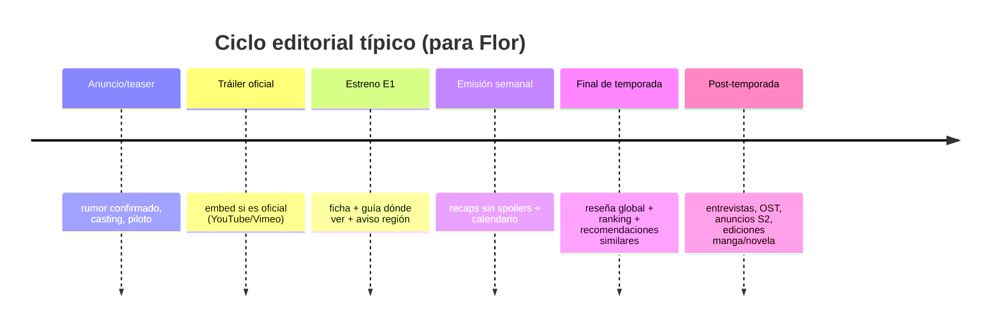

# Informe de investigación sobre el ecosistema BL para el sitio de Flor

## Resumen ejecutivo

El ecosistema BL (Boys’ Love) para público hispanohablante se apoya, hoy, en tres “capas” complementarias: (a) **bases de datos y calendarios** (para descubrir títulos, fechas y países), (b) **distribución (legal) y marketing** —principalmente mediante canales oficiales en YouTube y plataformas OTT/licenciadas—, y (c) **comunidades y curadores** (blogs, foros, newsletters y podcasts) que convierten estrenos y catálogos en conversación, guías y recomendaciones. La oportunidad para el sitio de Flor es posicionarse como **curaduría en español** con foco en “dónde ver” y “qué sale”, con **embeds legales** solo donde existan y estén permitidos por políticas/ajustes. citeturn39view0turn40search0turn40search9turn41search0turn41search6

En términos de volumen de audiencia, plataformas comunitarias/BD como entity["organization","MyDramaList","asian drama database community"] operan a escala masiva (estimación Similarweb: **31,1M visitas** en enero de 2026), mientras que directorios BL especializados como entity["organization","World of BL","bl calendar and show list site"] se ubican en una escala intermedia (Similarweb: **~513,5K visitas** en los últimos 3 meses, según el panel público en español). citeturn39view0turn40search4

Sobre video y “embeber”: hay una diferencia operacional clave entre **plataformas abiertas** (YouTube/Vimeo/Dailymotion/Twitch, donde el embed suele estar soportado por iframe/SDK) y **plataformas OTT de catálogo/licencia** (p. ej., Viki/WeTV), donde el “embed” de episodios completos tiende a estar **restringido por DRM, licencias territoriales y términos**. Esto obliga a Flor a diseñar una integración por capas: **embeds cuando son oficiales y habilitados**, y **deep links + fichas + trailers** cuando no. citeturn46search3turn46search2turn15view2turn17view0

En productoras y sellos, el BL hispanohablante se alimenta de una mezcla de (i) producción audiovisual principalmente asiática (con productoras que publican episodios en canales oficiales), (ii) plataformas globales LGBTQ+ con “originals”, y (iii) sellos editoriales en España/Argentina con líneas BL/Yaoi (manga/manhwa) que funcionan como un “motor” de conversación y recomendaciones. citeturn31search0turn34search9turn34search2turn33search1turn32search1turn32search0

## Contexto y mapa del ecosistema BL

El BL se describe comúnmente como un género originado en manga japonés centrado en relaciones románticas/sexuales entre hombres; desde allí se expandió a formatos audiovisuales (series/films/web series) y a una infraestructura digital de calendarios, fandoms y guías de visionado. citeturn41search6

La cadena de valor práctica para un sitio como el de Flor puede modelarse como: **(1) anuncio/marketing** (trailers, clips, posters) → **(2) distribución** (canales oficiales, OTT por territorio) → **(3) descubrimiento** (bases de datos, tags, calendarios) → **(4) conversación** (comunidades, reseñas, podcasts) → **(5) re-consumo** (clips, playlists, “best moments”, recomendaciones). Directorios como World of BL estructuran precisamente el segmento (3) y parte del (5) con calendarios “día a día” (p. ej., entradas fechadas para el 17 de febrero de 2026). citeturn40search0turn40search9

```mermaid
mindmap
  root((Ecosistema BL))
    Producción
      "Productoras (Thai/JP/KR/TW)"
      "Creadores indie (LatAm)"
      "Sellos editoriales (manga/novelas)"
    Distribución
      "Canales oficiales (YouTube)"
      "OTT/licencias por territorio"
      "Festivales / estrenos"
    Descubrimiento
      "Bases de datos (tags, listas)"
      "Calendarios de estrenos"
      "Listas por país/año"
    Conversación
      "Foros (Reddit)"
      "Blogs & newsletters"
      "Podcasts"
    Sitio de Flor
      "Fichas de títulos"
      "Guías dónde ver"
      "Calendario"
      "Embeds legales"
      "Entrevistas / análisis"
```

image_group{"layout":"carousel","aspect_ratio":"16:9","query":["Thai BL drama couple promotional still","BL manga shelf yaoi boys love","LGBTQ streaming platform interface","Boys Love fandom community forum"],"num_per_query":1}

## Sitios, blogs, foros y comunidades relevantes

La tabla prioriza: (a) recursos que **estructuran catálogos y calendarios**, (b) comunidades “granulares” con actividad constante, y (c) curadores con producción sostenida. Cuando existe métrica pública accesible, se adjunta (Similarweb para web; “members” para subreddit).

### Sitios y comunidades hispanohablantes

| Recurso                                                                         | Tipo                   | Idioma | Alcance                                               | Audiencia estimada (pública) | Enlace directo                                                                | Por qué importa para Flor                                                                                       |
| ------------------------------------------------------------------------------- | ---------------------- | ------ | ----------------------------------------------------- | ---------------------------: | ----------------------------------------------------------------------------- | --------------------------------------------------------------------------------------------------------------- |
| entity["organization","BoysLoveTalk","spanish bl newsletter"]                | Newsletter/blog        | ES     | Global (hispano)                                      |               N/D (Substack) | `https://www.boyslovetalk.com/` citeturn36view0turn35view0                | Cobertura de industria BL en español (estrenos, licencias, guías). Útil como referencia temática y de agenda.   |
| entity["organization","Yaoi Wiki","fandom wiki spanish"]                     | Wiki/Comunidad         | ES     | Global                                                |                          N/D | `https://yaoi.fandom.com/es/wiki/Yaoi_Wiki` citeturn1search18              | Glosario y vocabulario fandom (útil para secciones “qué significa…”, con cuidado editorial).                    |
| entity["organization","manga_abierto (LiveJournal)","spanish yaoi tag blog"] | Blog/Archivo           | ES     | Regional/global                                       |                          N/D | `https://manga-abierto.livejournal.com/tag/yaoi` citeturn30search21        | Ejemplo de reseñas históricas/archivo BL en español (sirve para inspirar taxonomía y tono).                     |
| entity["organization","Ediciones Tomodomo","spanish manga publisher"]        | Editorial / catálogo   | ES     | España (y export)                                     |                          N/D | `https://www.ediciones-tomodomo.com/títulos` citeturn33search1             | Fuente primaria para licencias BL en español (manga BL como categoría). Ideal para fichas “edición en español”. |
| entity["company","Editorial Ivrea Argentina","manga publisher argentina"]    | Editorial / catálogo   | ES     | entity["country","Argentina","country"] (y región) |                          N/D | `https://www.ivrea.com.ar/yaoi-bl/` citeturn32search1                      | Línea BL/Yaoi explícita como categoría editorial; útil para “dónde comprar/qué se publica”.                     |
| entity["company","Milky Way Ediciones","spanish manga publisher"]            | Editorial / e-commerce | ES     | entity["country","Spain","country"] / global       |    N/D (listado de catálogo) | `https://www.milkywayediciones.com/collections/all/yaoi` citeturn32search0 | Catálogo BL/Yaoi extenso (listados por tag). Excelente para curación editorial y novedades.                     |
| entity["company","Panini (España)","publisher spain"]                        | Editorial / tienda     | ES     | España                                                |                          N/D | `https://www.panini.es/shp_esp_es/comics/manga/bl.html` citeturn32search2  | Sección BL/Yaoi como categoría de tienda; útil para guías de compra y fichas de ediciones.                      |

### Sitios y comunidades globales

| Recurso                                                                  | Tipo                        | Idioma     | Alcance |                        Audiencia estimada (pública) | Enlace directo                                                | Por qué importa para Flor                                                                                                                                                                                                   |
| ------------------------------------------------------------------------ | --------------------------- | ---------- | ------- | --------------------------------------------------: | ------------------------------------------------------------- | --------------------------------------------------------------------------------------------------------------------------------------------------------------------------------------------------------------------------- |
| entity["organization","MyDramaList","asian drama database community"] | Base de datos + comunidad   | EN (multi) | Global  |        **31,1M visitas/mes** (ene 2026, Similarweb) | `https://mydramalist.com/` citeturn39view0                 | “Backbone” para fichas: títulos, cast, tags, listas de usuarios. Útil como referencia de metadatos (no como fuente única).                                                                                                  |
| entity["organization","World of BL","bl calendar and show list site"] | Directorio + calendario     | EN         | Global  |            **~513,5K visitas/3 meses** (Similarweb) | `https://world-of-bl.com/` citeturn40search0turn40search4 | Calendario por día y listados por país/año; ideal para inspirar el “calendario de estrenos” de Flor. citeturn40search9turn40search6                                                                                     |
| r/boyslove                                                               | Foro                        | EN (multi) | Global  | **~152K members** (dato público en vista de Reddit) | `https://www.reddit.com/r/boyslove/` citeturn4search4      | Excelente para detectar tendencias, expectativas y recepción. Requiere moderación si se integra (UGC).                                                                                                                      |
| entity["organization","BL Watcher","bl reviews and series list blog"] | Blog/guías                  | EN         | Global  |    ~574,6K visitas/3 meses (comparativa Similarweb) | `https://blwatcher.com/` citeturn40search2turn40search4   | Reseñas, listas por año/país; benchmark de estructura de reseñas y fichas.                                                                                                                                                  |
| entity["organization","BL Bliss","bl reviews blog"]                   | Blog/reseñas                | EN         | Global  |                                                 N/D | `https://blbliss.com/` citeturn41search0                   | Enfoque de reseña + secciones (historia, glosario) útil como referencia editorial.                                                                                                                                          |
| entity["organization","GagaOOLala","lgbtq streaming platform"]        | Plataforma streaming LGBTQ+ | EN (multi) | Global  |                              N/D (catálogo público) | `https://www.gagaoolala.com/en/home` citeturn34search2     | Fuente primaria para “dónde ver” (catálogo y “originals”), útil para embeds si existieran (generalmente no públicos; depende del sitio).                                                                                    |
| entity["organization","Boys Love factory","bl link directory site"]   | Directorio/agregador        | EN         | Global  |                                                 N/D | `https://boyslovefactory.com/` citeturn41search1           | Útil solo como benchmark de taxonomía. _Riesgo_: el propio sitio indica que no hostea videos y que el contenido “se encuentra en internet”; requiere auditoría de legalidad antes de inspirar enlaces. citeturn41search1 |

## Video y embeber: políticas, ejemplos y tabla comparativa

### Principio rector para Flor

“Embeber” (iframe/SDK) no equivale a “tener derecho a redistribuir”. La regla operacional más segura para Flor es: **embeber únicamente cuando la plataforma lo soporte oficialmente y el propietario del video haya habilitado el embed**, y **no embeber** cuando los términos prohíban _framing/linking_ no autorizado o cuando el contenido esté bajo DRM/licencia cerrada. citeturn46search3turn15view2turn17view0

Desde el lado técnico, `<iframe>` es el mecanismo estándar de incrustación web (contexto de navegación anidado). En la práctica, cada plataforma agrega restricciones (parámetros obligatorios, privacidad por dominio, geobloqueo, etc.). citeturn16search10

### Tabla comparativa de plataformas de video

| Plataforma                                                   |                         ¿Permite embed? | Condiciones clave (resumen)                                                                                                                                                                                          | Coste/limitaciones típicas                                                                                                         | Ejemplo de uso                                       |
| ------------------------------------------------------------ | --------------------------------------: | -------------------------------------------------------------------------------------------------------------------------------------------------------------------------------------------------------------------- | ---------------------------------------------------------------------------------------------------------------------------------- | ---------------------------------------------------- |
| YouTube                                                      |                                      Sí | Se embebe por iframe; el creador puede deshabilitar “Allow embedding”; además, las políticas/ToS aplican al uso del reproductor embebido. citeturn46search3turn22search12turn9search21                          | El embed puede fallar si el video no permite inserción o por restricciones de región.                                              | Ver snippet abajo (“Ejemplos de código”).            |
| Vimeo                                                        |                                      Sí | Embed con control de privacidad: el dueño define “dónde puede embeberse” (incluye restricciones por dominio). Algunas funciones dependen del plan. citeturn46search2turn46search5turn46search7                  | Limitaciones por plan (controles/branding/privacidad avanzada). citeturn46search7                                               | Ver snippet abajo.                                   |
| Dailymotion                                                  |                                      Sí | Player embebible por iframe y/o script; la integración oficial remite a documentación de “Player Embed”. citeturn7search5turn7search6                                                                            | Puede incluir publicidad según configuración/territorio.                                                                           | Ver snippet abajo.                                   |
| Twitch                                                       |                                      Sí | Requiere declarar dominios mediante parámetro `parent` al embeber (iframe/JS). citeturn46search1turn46search0                                                                                                    | Integración sensible a dominios permitidos; chat y autenticación se comportan similar al sitio. citeturn46search9turn46search1 | Ver snippet abajo.                                   |
| Bilibili                                                     |      Sí (en general vía código “Share”) | Existen flujos de “compartir → código de inserción” que generan iframe (player.bilibili.com). Se recomienda usar métodos oficiales. citeturn4search14turn21view0                                                 | Interfaz y disponibilidad pueden ser regionales/idioma; algunos contenidos pueden no embeberse.                                    | Ver snippet abajo.                                   |
| entity["organization","iQIYI","asian streaming platform"] |       Sí (vía Player API / integración) | Documentación describe “Player API” y posibilidad de embeber en páginas de reproducción; típicamente orientado a integraciones/partners. citeturn23view0                                                          | Probable requerimiento de acceso a APIs/relación comercial; no es “copiar iframe y listo”.                                         | “No aplica” como snippet universal; depende del API. |
| WeTV                                                         | Parcial / no recomendado para episodios | Términos: servicio para uso privado/no comercial; prohíbe “incorporar la plataforma o parte en otro programa/producto”; además restringe enlaces desde sitios no propios. citeturn17view0turn18view4turn18view3 | Licencias territoriales; “service content” varía por ubicación. citeturn17view0                                                 | Recomendado: link-out a página oficial.              |
| Viki                                                         |       No (salvo autorización explícita) | Términos: prohíbe usar tecnología para “acceder, indexar, frame o link” al servicio/contenido de modo no autorizado. citeturn15view2turn14view0                                                                  | Contenido/funciones varían por ubicación (licencia territorial). citeturn14view0                                                | Recomendado: link-out + ficha + tráiler en YouTube.  |
| LINE TV                                                      |          No (servicio EOL en Tailandia) | Cierre comunicado para Tailandia (fin de servicio y retiro de docs). citeturn16search9turn16search1                                                                                                              | No disponible como fuente estable actual.                                                                                          | No aplica.                                           |

### Ejemplos de código de embed

**YouTube (iframe simple)** citeturn46search3turn9search21

```html
<iframe
  width="560"
  height="315"
  src="https://www.youtube.com/embed/VIDEO_ID"
  title="YouTube video player"
  frameborder="0"
  allow="accelerometer; autoplay; clipboard-write; encrypted-media; gyroscope; picture-in-picture; web-share"
  allowfullscreen
>
</iframe>
```

**Vimeo (iframe simple; luego se controla privacidad por dominio desde la cuenta/video)** citeturn46search2turn46search5

```html
<iframe
  src="https://player.vimeo.com/video/VIDEO_ID"
  width="640"
  height="360"
  frameborder="0"
  allow="autoplay; fullscreen; picture-in-picture"
  allowfullscreen
>
</iframe>
```

**Dailymotion (iframe player)** citeturn7search5turn7search6

```html
<iframe
  frameborder="0"
  width="640"
  height="360"
  src="https://www.dailymotion.com/embed/video/VIDEO_ID"
  allow="autoplay; fullscreen; picture-in-picture"
  allowfullscreen
>
</iframe>
```

**Twitch (iframe con `parent`)** citeturn46search0turn46search1

```html
<iframe
  src="https://player.twitch.tv/?channel=CHANNEL_NAME&parent=tu-dominio.com&muted=true"
  height="360"
  width="640"
  frameborder="0"
  scrolling="no"
  allowfullscreen="true"
>
</iframe>
```

**Bilibili (iframe típico del “código de inserción” vía compartir)** citeturn4search14turn21view0

```html
<iframe
  src="//player.bilibili.com/player.html?bvid=BVxxxxxxxxxx"
  scrolling="no"
  frameborder="0"
  allowfullscreen="true"
  width="640"
  height="360"
>
</iframe>
```

### Diagrama de flujo recomendado para embeds legales

```mermaid
flowchart TD
  A[Flor: ficha del título] --> B{¿Hay video oficial\n(tráiler/ep) y embed permitido?}
  B -- Sí --> C[Usar iframe/SDK oficial]
  C --> D{¿El video está geobloqueado\n o embed deshabilitado?}
  D -- No --> E[Mostrar embed]
  D -- Sí --> F[Fallback: link-out + aviso región + alternativas]
  B -- No --> G[No embeber]
  G --> H[Mostrar: links oficiales + plataformas por país + sinopsis + cast]
```

## Productoras, distribuidoras y sellos con foco en BL

### Productoras y distribuidoras audiovisuales relevantes

| Actor del ecosistema                                                                                                           | Rol                                  | Región principal                          | Evidencia/foco BL (ejemplos)                                                                                                                                                                                                                         | Enlace directo                                                                                                                        |
| ------------------------------------------------------------------------------------------------------------------------------ | ------------------------------------ | ----------------------------------------- | ---------------------------------------------------------------------------------------------------------------------------------------------------------------------------------------------------------------------------------------------------- | ------------------------------------------------------------------------------------------------------------------------------------- |
| entity["company","GMMTV","thai tv production and talent"]                                                                   | Productora / canal oficial           | entity["country","Thailand","country"] | Canal oficial con gran alcance (20,1M suscriptores). citeturn31search0 Además, hay series BL publicadas gratis en YouTube con subtítulos ES en canales oficiales (mencionado como práctica para GMMTV en guías en español). citeturn26search14 | `https://www.youtube.com/channel/UC8BzJM6_VbZTdiNLD4R1jxQ` citeturn31search0                                                       |
| entity["organization","Mandee Channel","thai bl channel"] / entity["company","Domundi","thai production collective"]     | Estudio/productora + canal           | Tailandia                                 | “Cutie Pie” figura como serie BL; y la compañía asociada (Domundi) aparece en la ficha pública de la serie. citeturn34search0turn34search5 Mandee Channel aloja playlists/episodios. citeturn34search3turn31search1                          | `https://www.youtube.com/channel/UC_HtEPrXQYKJ9Pihwg0u1Rw` citeturn31search1                                                       |
| entity["company","Be On Cloud","thai production company"]                                                                   | Productora                           | Tailandia                                 | “KinnPorsche” lista a Be On Cloud como compañía. citeturn34search9 Canal con ~1,06M suscriptores (indicador de tracción directa). citeturn31search3                                                                                            | `https://www.youtube.com/@beoncloudofficial` citeturn31search3                                                                     |
| entity["company","Studio Wabi Sabi","thai production studio"]                                                               | Estudio/productora + canal           | Tailandia                                 | Canal oficial con ~2,67M suscriptores (amplificación de estrenos, teasers, eventos). citeturn31search2                                                                                                                                            | `https://www.youtube.com/c/studiowabisabi` citeturn31search2                                                                       |
| entity["organization","Crave","canadian streaming service"] + entity["company","Bell Media","canadian media company"]    | Plataforma + productora/distribución | entity["country","Canada","country"]   | Caso de estudio “BL global”: la página oficial de Crave indexa la serie y fecha. citeturn38search13 El comunicado de Bell Media confirma continuidad/temporada 2. citeturn38search2                                                            | `https://www.crave.ca/en/series/heated-rivalry-59137` citeturn38search13                                                           |
| entity["company","Warner Bros. Discovery","global media company"] / entity["organization","HBO Max","streaming service"] | Distribución internacional           | Global                                    | Comunicado oficial fija estreno en HBO Max (EE.UU./Australia) y dinámica semanal. citeturn38search5                                                                                                                                               | `https://press.wbd.com/us/media-release/hbo-max/romantic-drama-series-heated-rivalry-debuts-november-28-hbo-max` citeturn38search5 |
| entity["organization","Elas Nas Artes","brazilian arts association"]                                                        | Producción indie                     | entity["country","Brazil","country"]   | Ejemplo de producción BL brasileña (“DESTINO”) estrenada en YouTube, liderada por la asociación; se menciona disponibilidad gratuita y subtitulado vía traducción automática. citeturn35view0                                                     | `https://www.boyslovetalk.com/p/destino-lanzan-mini-serie-brasilena` citeturn35view0                                               |
| entity["organization","GagaOOLala","lgbtq streaming platform"]                                                              | Plataforma + “originals”             | Global (base Asia)                        | Tiene sección “Originals” visible en home y playlists dedicadas. citeturn34search2turn34search4                                                                                                                                                  | `https://www.gagaoolala.com/en/home` citeturn34search2                                                                             |

### Sellos editoriales (manga/BL en español) como “fuentes primarias” de licencias

Un sitio BL para audiencia hispanohablante suele ganar tracción cuando cruza “dramas/series” con “manga/manhwa/novelas” porque parte de la conversación de series se origina o se alimenta por licencias editoriales. Las siguientes páginas son útiles para fichas “edición en español / dónde conseguir”.

- entity["company","Milky Way Ediciones","spanish manga publisher"]: catálogo etiquetado “Yaoi” con listado de productos. citeturn32search0
- entity["company","Ediciones Tomodomo","spanish manga publisher"]: títulos filtrables por “Manga BL”. citeturn33search1
- entity["company","Editorial Ivrea Argentina","manga publisher argentina"]: categoría “Yaoi-BL”. citeturn32search1
- entity["company","Panini (España)","publisher spain"]: categoría BL/Yaoi en tienda (y explicación del género en su sección por géneros). citeturn32search2turn32search5

## Creadores e influencers en español y global

Para Flor, “influencia útil” no es solo alcance: también es **constancia**, **capacidad de explicar dónde ver legalmente** y **estructura editorial** (reseñas sin spoilers, guías por país, calendarios). A continuación, una selección con métricas públicas accesibles.

| Cuenta/canal/recurso                                                         | Formato                                         | Idioma                         | Señal pública de alcance/actividad                                                                            | Enlace directo                                                                                           |
| ---------------------------------------------------------------------------- | ----------------------------------------------- | ------------------------------ | ------------------------------------------------------------------------------------------------------------- | -------------------------------------------------------------------------------------------------------- | ------------------------------------------------------------------------------- |
| entity["company","GMMTV","thai tv production and talent"] (canal oficial) | YouTube (oficial)                               | TH/EN (subs multi según video) | 20,1M suscriptores (YouTube). citeturn31search0                                                            | `https://www.youtube.com/channel/UC8BzJM6_VbZTdiNLD4R1jxQ`                                               |
| entity["organization","Mandee Channel","thai bl channel"]                 | YouTube (oficial)                               | TH/EN (subs multi según video) | 2,94M suscriptores (YouTube). citeturn31search1                                                            | `https://www.youtube.com/channel/UC_HtEPrXQYKJ9Pihwg0u1Rw`                                               |
| entity["company","Studio Wabi Sabi","thai production studio"]             | YouTube (oficial)                               | TH/EN                          | 2,67M suscriptores (YouTube). citeturn31search2                                                            | `https://www.youtube.com/c/studiowabisabi`                                                               |
| entity["company","Be On Cloud","thai production company"]                 | YouTube (oficial)                               | TH/EN                          | 1,06M suscriptores (YouTube). citeturn31search3                                                            | `https://www.youtube.com/@beoncloudofficial`                                                             |
| entity["organization","BoysLoveTalk","spanish bl newsletter"]             | Newsletter/blog                                 | ES                             | Publica notas con fecha y foco en disponibilidad (ej. LatAm). citeturn36view0turn35view0                  | `https://www.boyslovetalk.com/`                                                                          |
| entity["podcast","Hablemos de BL","ivoox podcast bl"]                     | Podcast                                         | ES                             | Actividad sostenida: episodios numerados al menos hasta “Ep.64” (publicados en iVoox). citeturn28view0     | `https://www.ivoox.com/podcast-hablemos-bl_sq_f11228168_1.html`                                          |
| entity["podcast","El Rincón BL","ivoox podcast bl"]                       | Podcast                                         | ES                             | Página muestra “EP 34” y listado de episodios; útil como benchmark de tópicos recurrentes. citeturn29view0 | `https://www.ivoox.com/podcast-rincon-bl_sq_f11516428_1.html`                                            |
| entity["podcast","Fujoshi Senpai                                           | Boys Love, Yaoi, shojo","spreaker podcast es"] | Podcast                        | ES                                                                                                            | Descripción editorial clara (“te recomendaré mangas, manwhas, novelas…”) en Spreaker. citeturn43view0 | `https://www.spreaker.com/podcast/fujoshi-senpai-boys-love-yaoi-shojo--4601507` |
| entity["organization","BL Watcher","bl reviews and series list blog"]     | Blog/guías                                      | EN                             | “About” define foco BL (dramas, yaoi, etc.). citeturn40search2                                             | `https://blwatcher.com/about-bl-watcher/`                                                                |
| entity["organization","World of BL","bl calendar and show list site"]     | Calendario/guías                                | EN                             | Calendario por fecha (ej. 17 feb 2026) y listados por país. citeturn40search9turn40search6                | `https://world-of-bl.com/Calendar/index.php`                                                             |

**Nota metodológica sobre métricas:** en redes sociales (Instagram/Facebook/X) la extracción de followers a veces está limitada por bloqueos de la propia plataforma (anti-scraping). En este informe, por rigor, se priorizaron métricas accesibles de forma estable (Similarweb/YouTube/Reddit/iVoox/Spreaker). citeturn39view0turn40search4turn31search0turn4search4turn29view0turn43view0

## Propuesta editorial y estructura del sitio de Flor

### Tipos de contenido recomendados (alineados al público BL hispanohablante)

1. **Fichas de títulos** (drama/serie/película/manga): sinopsis breve, país, año, tags, avisos de contenido (sin morbo), cast, links oficiales, y **tráiler embebido** solo si es legal y permitido. Inspiración: la claridad de “dónde ver/qué sale” que aparece en enfoques de calendario/directorio. citeturn40search9turn40search6turn46search3

2. **Guías de streaming por país** (LatAm/Argentina/España como vistas principales): la disponibilidad cambia por territorio en plataformas como Viki/WeTV, y también por acuerdos de distribución. Esto hace valioso un módulo “Disponible en tu región” con fallback a alternativas. citeturn14view0turn17view0

3. **Calendario editorial**:

- “Hoy” (estrenos episodios) y “Próximamente” (nuevas series).
- Exportable a `.ics` (suscripción).  
  Benchmark directo: calendarios diarios del ecosistema. citeturn40search9turn40search0

4. **Reseñas y guías episódicas** (evitar spoilers o separarlos): estructura tipo “qué funcionó / a quién le puede gustar / dónde ver legalmente”. Sitios de reseñas BL muestran que el usuario busca orden y continuidad. citeturn40search5turn41search0

5. **Embeds legales y “media kits”**: clips oficiales (YouTube/Vimeo/Dailymotion/Twitch) con política clara; para OTT cerradas: solo link-out. citeturn46search3turn46search2turn15view2turn17view0

### Estructura de páginas sugerida

```text
Home
 ├─ Destacados de la semana (cards)
 ├─ Calendario (hoy / próximos 7 días)
 ├─ Guía rápida: "¿Dónde ver BL legalmente?"
 └─ Últimas notas (newsletter/blog)

Explorar
 ├─ Por país (TH / JP / KR / TW / Occidente / LatAm)
 ├─ Por formato (Serie / Película / Manga / Webtoon)
 └─ Por tags (comedia, escolar, workplace, etc.)

Ficha de título
 ├─ Header: póster + datos clave + rating editorial
 ├─ Dónde ver (por país) + avisos (geo/DRM)
 ├─ Tráiler (embed legal) / clips
 ├─ Sinopsis + reparto + equipo
 ├─ Episodios + links oficiales
 └─ Artículos relacionados (reseña, entrevistas, noticias)

Calendario
 ├─ Vista mensual
 ├─ Vista semanal (episodios)
 └─ Exportar ICS
```

### Timeline del “ciclo de vida” editorial de un título BL (para planificar contenidos)



### Checklist de cumplimiento (operativo) para embeds

- **YouTube**: validar que el video permite embed (“Allow embedding”), y recordar que políticas/ToS aplican al reproductor embebido. citeturn46search3turn22search12
- **Vimeo**: revisar privacidad por dominio (“Where can this video be embedded?”) y considerar límites por plan. citeturn46search5turn46search7
- **Twitch**: incluir `parent` con el/los dominios donde se embeberá. citeturn46search1turn46search0
- **Viki/WeTV**: evitar embedding/framing salvo permiso explícito; sus términos restringen _framing/linking_ no autorizado o incorporar la plataforma en otros productos. citeturn15view2turn18view4turn18view3
- **LINE TV**: tratar como fuente inestable/no vigente por cierre (al menos en Tailandia). citeturn16search9turn16search1
